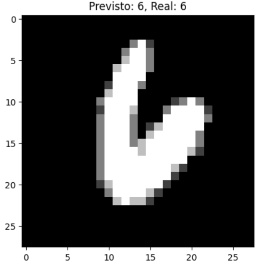
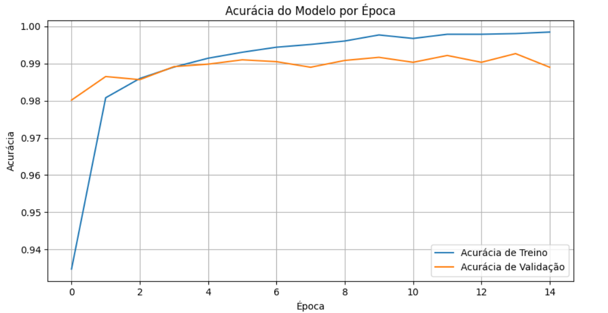
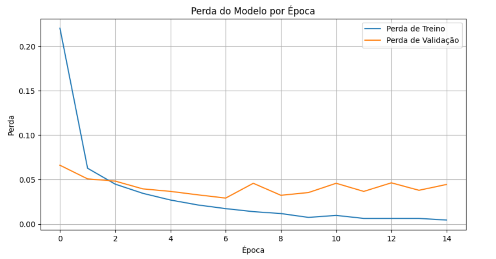

# 🧠 Reconhecimento de Dígitos com Rede Neural Convolucional (CNN)

---

## 🎯 Sobre o Projeto

Este projeto consiste na construção de uma **Rede Neural Convolucional (CNN)**, utilizando Python e a biblioteca TensorFlow/Keras, com o objetivo de classificar dígitos manuscritos. O modelo foi treinado e avaliado com o renomado dataset **MNIST**, uma coleção de 70.000 imagens em escala de cinza que serve como um dos principais benchmarks na área de Visão Computacional.

O desenvolvimento deste projeto serviu para aplicar e demonstrar na prática os seguintes conceitos:
- Pré-processamento e normalização de dados de imagem.
- Construção de uma arquitetura de CNN camada a camada (`Conv2D`, `MaxPooling2D`, `Flatten`, `Dense`).
- Compilação e treinamento de um modelo de Deep Learning.
- Avaliação de performance com métricas como acurácia e perda.
- Análise de curvas de aprendizado para diagnosticar o treinamento.

---

## ✨ Demonstração Visual

A imagem abaixo ilustra o modelo em ação, realizando uma previsão correta em uma amostra do conjunto de teste que nunca havia visto durante o treinamento.

---

## 🛠️ Tecnologias Utilizadas

O projeto foi desenvolvido com as seguintes tecnologias e bibliotecas:

- **Python:** Linguagem de programação principal.
- **TensorFlow/Keras:** Framework para construção e treinamento da rede neural.
- **NumPy:** Para manipulação eficiente de arrays numéricos.
- **Matplotlib:** Para visualização dos dados e dos resultados.
- **Jupyter Notebook:** Ambiente de desenvolvimento interativo.
- **Git & GitHub:** Para versionamento e hospedagem do código.

---

## 📊 Resultados e Análise

O modelo foi treinado por 15 épocas e avaliado no conjunto de teste de 10.000 amostras.

- **Acurácia Final no Conjunto de Teste:** **98.90%** 

As curvas de aprendizado abaixo demonstram que o modelo teve um treinamento saudável, com as métricas de treino e validação convergindo de forma estável e sem sinais evidentes de overfitting.

**Acurácia do Modelo por Época**

**Perda do Modelo por Época**

---
